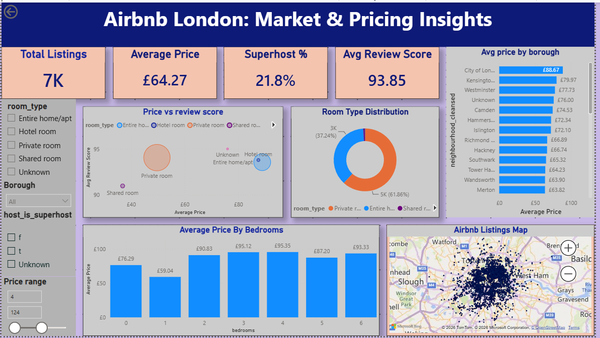

# Airbnb London: Market Analysis & Price Prediction

A full data analytics project on London's Airbnb market — covering data cleaning, exploratory analysis, machine learning price prediction, NLP sentiment analysis on 1.7M+ reviews, and an interactive Power BI dashboard.



---

## 📌 Problem Statement

London's Airbnb market is fragmented across 32 boroughs, making it hard for hosts and analysts to know what really drives nightly pricing, guest satisfaction, and listing availability — or how to price competitively.

**Objectives:**
- Explore pricing patterns across boroughs, room types, and bedroom counts
- Predict nightly price using listing attributes with ML regression models
- Quantify guest sentiment from review text at scale using NLP
- Deliver an interactive dashboard for stakeholders to explore findings live

---

## 🗂️ Dataset

| | |
|---|---|
| **Source** | [Inside Airbnb](http://insideairbnb.com/) — London listings snapshot (2019) |
| **Listings** | 9,230 cleaned records across 32 boroughs, 45+ features |
| **Reviews corpus** | 1.7M+ guest review comments (used for sentiment analysis) |
| **Geodata** | Latitude/longitude for every listing (used in map + spatial EDA) |

---

## 🛠️ Tools & Libraries

- **Python** — pandas, numpy (data wrangling & cleaning)
- **Visualization** — matplotlib, seaborn, folium (EDA & geospatial plots)
- **Machine Learning** — scikit-learn (Linear Regression, Random Forest)
- **NLP** — NLTK (VADER) for sentiment scoring on review text
- **Dashboard** — Power BI Desktop (interactive dashboard with slicers & cross-filtering)

---

## 🔄 Methodology

1. **Data Collection** — raw listings & reviews from Inside Airbnb
2. **Data Cleaning** — handled missing values, removed price outliers (IQR method), fixed data types, de-duplicated
3. **Exploratory Data Analysis** — pricing patterns, room type distribution, availability, correlations
4. **Predictive Modeling** — trained Linear Regression and Random Forest to predict nightly price
5. **Sentiment Analysis** — scored 1.7M+ review comments with NLTK VADER
6. **Dashboard Build** — assembled all findings into an interactive Power BI dashboard

---

## 🧹 Data Preparation

- Dropped columns with >50% missing values
- Imputed numeric fields with median, categorical fields with "Unknown"
- Converted price strings (e.g. `"$120.00"`) to clean numeric values
- Removed price outliers using the IQR method
- Parsed review dates to datetime; removed duplicate rows

---

## 📊 Exploratory Data Analysis — Key Findings

- **Location drives price** — central boroughs (City of London, Kensington & Chelsea) command the highest average nightly rates; City of London prices nearly **4x** higher than Bexley (£155 vs £41/night)
- **Room type mix** — private rooms (51%) and entire homes (48%) make up nearly the entire market
- **Price vs. reviews** — weak relationship; expensive listings aren't reviewed more often (correlation ≈ −0.001)
- **Availability** — most listings cluster at low or very-high availability, with few in the middle

---

## 🤖 Machine Learning — Price Prediction

Two regression models were trained to predict nightly price from listing attributes (`minimum_nights`, `availability_365`, `number_of_reviews`, `reviews_per_month`, `calculated_host_listings_count`):

| Model | MAE (£) | RMSE (£) | R² Score |
|---|---|---|---|
| Linear Regression | 44.44 | 55.75 | 0.065 |
| **Random Forest** | **40.74** | **53.05** | **0.153** |

**Top predictive features:** `reviews_per_month` (25.4%) and `availability_365` (25.1%)

> Random Forest outperforms Linear Regression, but both R² scores are modest — indicating price is influenced by factors beyond these five features, especially **location**, which wasn't included as a direct model input. This is a clear direction for future improvement (see below).

---

## 💬 Sentiment Analysis

Guest review comments (1.7M+) were scored using NLTK's VADER sentiment analyzer and categorized as Positive, Neutral, or Negative:

| Sentiment | % of Reviews |
|---|---|
| Positive | 86.1% |
| Neutral | 9.6% |
| Negative | 4.2% |

Guest satisfaction is overwhelmingly high across the platform, regardless of listing price.

> 📦 **Note:** The full sentiment-scored reviews file (`reviews_with_sentiment.csv`, ~1.7M rows / 101MB) exceeds GitHub's 100MB file limit, so it isn't hosted directly in this repo. It's available here instead: **[https://drive.google.com/file/d/1bHGWqHJw3uzvNqVmvR1DdN4ihGIkMoyz/view?usp=sharing]**. The sentiment analysis code that generates it is fully included in the notebook.

---

## 📈 Power BI Dashboard

An interactive single-page dashboard built in Power BI, featuring:

- **4 KPI cards** — total listings, average price, superhost %, average review score
- **Slicers** — room type, borough, superhost status, price range (all cross-filtering)
- **Avg price by borough** — sorted bar chart
- **Room type distribution** — donut chart
- **Avg price by bedrooms** — column chart
- **Price vs. review score** — scatter plot
- **Live geospatial map** — all 9,230 listings plotted across London

📁 The `.pbix` file is included in this repo — open it in Power BI Desktop to explore interactively.

---

## 🔑 Key Insights

1. **Location is the #1 price driver** — City of London prices ~4x higher than Bexley
2. **Guests are overwhelmingly satisfied** — 86.1% Positive sentiment across 1.7M+ reviews
3. **Price barely predicts satisfaction** — correlation between price and review score is effectively zero
4. **ML price prediction has room to grow** — modest R² confirms location matters more than the modeled features
5. **Superhosts outperform on service, not price** — 96.4 avg review score vs. 93.1 for others, while charging £9 less per night
6. **The market is nearly split in two** — private rooms (51%) and entire homes (48%) dominate

---

## ✅ Recommendations

- Price primarily by location — it's the strongest driver found
- Don't discount listings to chase better reviews — price has no measurable effect on rating
- Add borough/coordinates as model features to significantly boost price prediction accuracy
- Study the 4.2% negative reviews to identify common complaint themes
- Support hosts in reaching Superhost status — it lifts guest ratings without requiring lower prices

---

## 🚀 Future Scope

- Encode borough/location directly as a model feature to improve R²
- Try advanced models (XGBoost, gradient boosting) with hyperparameter tuning
- Time-series analysis of pricing trends across the calendar year
- Topic modeling on negative reviews to surface specific complaint themes
- Automate a live-refresh Power BI data pipeline

---

## 📁 Repository Structure

```
airbnb-london-dashboard/
│
├── Airbnb_Data_Analysis.ipynb        # Full analysis notebook (cleaning, EDA, ML, sentiment)
├── cleaned_listings.csv              # Cleaned dataset used for the dashboard
├── Airbnb_London_Dashboard.pbix      # Power BI dashboard file
├── dashboard_screenshot.png          # Dashboard preview image
├── Airbnb_London_Project_Presentation.pptx   # Project summary slide deck
└── README.md
```

> ℹ️ `reviews_with_sentiment.csv` (~101MB) is **not included** in this repo due to GitHub's 100MB file size limit — see the note in the Sentiment Analysis section above for the external link.

---

## ▶️ How to Explore This Project

1. **Notebook** — open `Airbnb_Data_Analysis.ipynb` in Jupyter or Google Colab to see the full cleaning, EDA, ML, and sentiment analysis workflow
2. **Dashboard** — open `Airbnb_London_Dashboard.pbix` in [Power BI Desktop](https://powerbi.microsoft.com/desktop/) (free) to interact with the live dashboard
3. **Slides/Summary** — view the `.pptx` or `.pdf` for a quick overview of findings

---

## 📄 Data Source

[Inside Airbnb](http://insideairbnb.com/) — London listings and reviews, 2019 snapshot.

## Let's connect

- LinkedIn: [www.linkedin.com/in/priyanka-raja-709174275]
- Gmail:[priyankaraja0123@gmail.com]